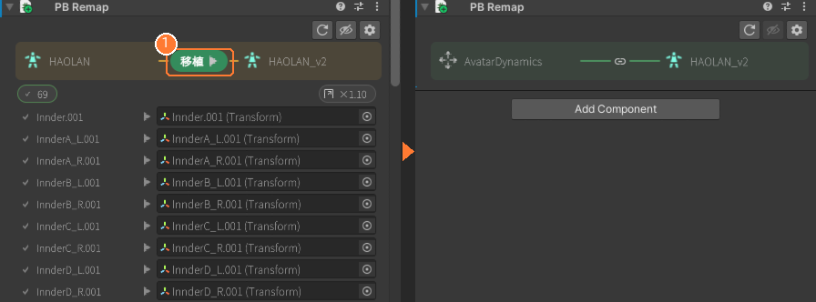
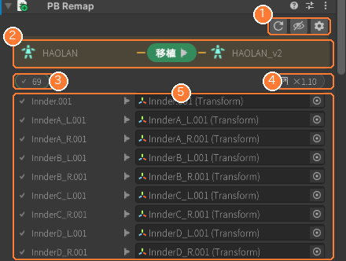
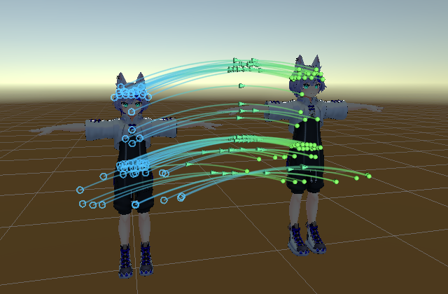
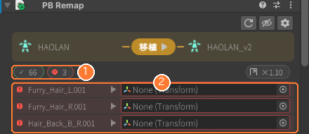
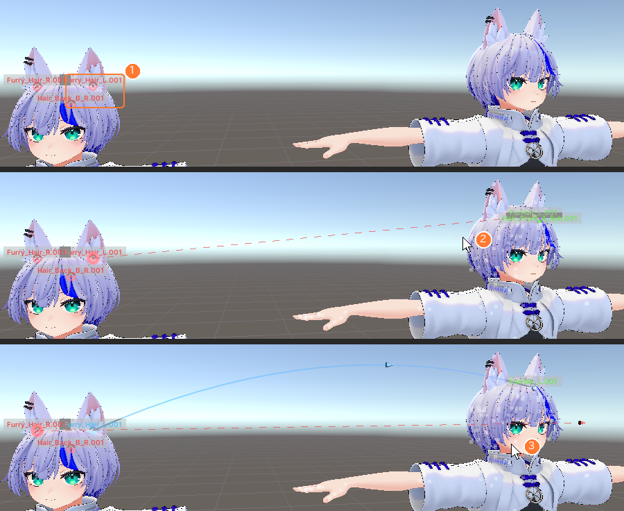
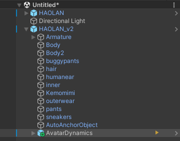
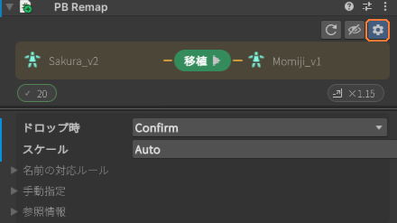

# PBRemap（移植機能）

AvatarDynamics 配下の PhysBone 等を、別のアバター/衣装/小物へボーン構成の違いを吸収しながら移植します。 
使い方は **PBRemap コンポーネントのついた AvatarDynamics を移植先へドラッグ＆ドロップするだけ** です。

再配置そのものの説明は [使い方](Usage.md) を参照してください。

## 手順

1. 移植元で PBReplacer の再配置を実行し、AvatarDynamics を作る
2. メインウィンドウ右上の ⋮ →「他のアバターへ移植 (PBRemap)...」で AvatarDynamics に PB Remap を付ける（Add Component からでも同じ）。移植元のボーン参照情報は自動で保存されます
3. AvatarDynamics を移植先アバターの子へドラッグ＆ドロップし、Inspector の **移植 ▶** を押す ①（Ctrl+Z で取り消せます）

移植後はアクションバーが緑の 🔗 になり、以後そのアバターの一部として扱われます。Prefab 化して別シーン・別プロジェクトへ持ち出しても、保存済みの参照情報から解決できます。

## Inspector の見方

| # | 部位 | 操作 |
|---|---|---|
| ① | ツールバー | ↻ 参照情報の取り直し   👁 SceneView に対応線を表示   ⚙ 詳細設定 |
| ② | アクションバー | 左が移植元、右が移植先（置き場所）  右のノードへ Hierarchy からアバター/衣装をドロップすると、その配下へ移動 |
| ③ | チップ | ✔ 解決済み / ＋ 自動作成 / ▾ 要選択 / ✖ 未解決 の件数を表示するチップ  クリックで対応表の表示を切り替え |
| ④ | スケール比 | クリックで 自動 / 手動 / なしに切替  コンポーネントの radius や height を補正します |
| ⑤ | 対応表 | 対応付けの一覧。右の欄へボーンをドロップすると手動で対応付け、▾ の一覧は候補から選択 |

SceneView では青の輪（移植元）→ 緑の点（移植先）を線で結びます。対応先が無いボーンの直し方は次を参照してください。

## 対応先がないボーン

移植先に同じ名前のボーンが無いと、その参照は ✖（未解決）になります。同じ名前のボーンが 2 つあるときは ▾（要選択）になります。移植は実行できますが、未解決の参照は移植元を指したまま残ります。

| # | 見え方 | 直し方 |
|---|---|---|
| ① | チップに ✖ の件数 | クリックすると表がその行だけになります |
| ② | 表に赤く（None）表示 | 右の欄へ移植先のボーンを Hierarchy からドロップ。▾ の行は ▾ から候補を選択 |

### ボーン対応ツール（SceneView）

SceneView では 👁 を押すと対応線が出て、未解決のボーンは赤い ✕ で示されます。クリックすると「ボーン対応」ツールが始まり、マウスに追従する点線で「どのボーンと結ぶか」を決められます。

| # | 操作 | 画面 |
|---|---|---|
| ① | 移植元の赤い ✕ をクリック | ツールが始まり、そのボーンから始まる点線がマウスに追従します |
| ② | 移植先のボーンにマウスを重ねる | ボーンに白い点が出ます。重ねたボーンは緑になり名前が表示されます |
| ③ | クリックで確定 | 青い線で結ばれ、次の未解決のボーンへ自動で進みます。Esc で終了 |

対応が決まったら Inspector の **移植 ▶** を押します。Hierarchy の AvatarDynamics バーには状態アイコンが出ます（▶ 移植できる / 🔗 接続済み / 参照切れ）。

## 詳細設定（⚙）

| 項目 | 内容 |
|---|---|
| ドロップ時 | **Confirm**: 置いた後に Inspector の ▶ で移植   **AutoOnDrop**: ドロップした時点で自動で移植（候補が複数ある参照だけ保留）   **BuildOnly**: 編集時は何もせず NDMF ビルド時に非破壊で移植 |
| スケール | Auto: Hips-Head 距離比 → ボーン間距離比   Manual: 世界寸法比を手入力   None: 補正しない |
| 名前の対応ルール | ボーン名やパスが異なるアバター間で使う対応ルール（双方向に適用） |
| 手動指定 | 自動検出が正しく動かないときに移植元/移植先を指定 |

## 対応している移植元 / 移植先

* VRCAvatarDescriptor 付きアバター（Humanoid ボーンで対応付け）
* Modular Avatar の MergeArmature 付き衣装（prefix/suffix を考慮）。衣装ルート配下に置いた AvatarDynamics は **衣装を単位** として扱われ、アバター本体のボーンや本体の AvatarDynamics には触れません
* Animator/Descriptor の無い小物（SkinnedMeshRenderer を持つオブジェクト。パス/名前で対応付け）

## NDMF との連携

NDMF が導入されている場合、PBRemap コンポーネントはビルド時（Resolving フェーズ）に自動で処理され、ビルド後のアバターからは取り除かれます。 
「ドロップ時」を **BuildOnly** にすると、編集中のシーンには手を加えず、ビルド時にだけ非破壊で移植します。

## 関連

* [使い方](Usage.md)
* [困ったとき](Troubleshooting.md)
