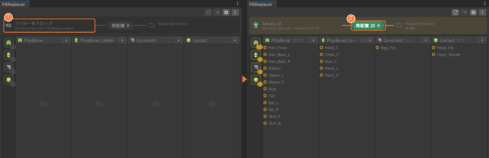
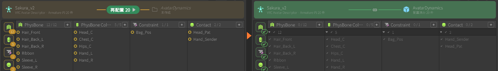
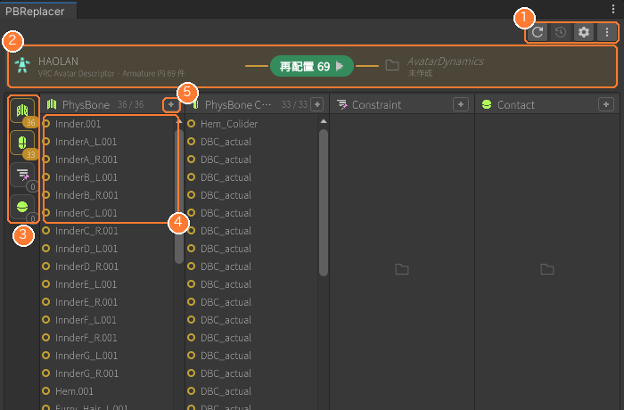
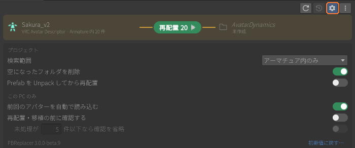

# PBReplacer の使い方

メインウィンドウ（Tools > PBReplacer）の操作説明です。導入と概要は [README](../README.md) を参照してください。

## 再配置の手順

1. **Tools > PBReplacer**（または Hierarchy の右クリック > PBReplacer for selected）でウィンドウを開く
2. 左のノードにアバターをドロップ ①（クリックして選ぶこともできます）
3. 真ん中の **再配置 n** を押す ②（n は未処理の件数）

再配置が終わるとアクションバーが緑になり、対象表示の ○ が ✔ に変わります。Ctrl+Z か ↶ で元に戻せます。

再配置後は、アバター直下の `AvatarDynamics` の中に 1 オブジェクト＝1 コンポーネントで並びます。

* 元のコンポーネントのパラメーターはそのまま引き継がれます
* PhysBone の Collider 参照は、再配置後のコンポーネントを指すように付け替えられます
* RootTransform が設定されていないものは自動で補完されます
* 再配置後のオブジェクト名は RootTransform のオブジェクト名になります

## ウィンドウの見方

| # | 部位 | 操作 |
|---|---|---|
| ① | ツールバー | ↻ 再読み込み / ↶ 元に戻す / ⚙ 詳細設定 / ⋮ その他（PBRemap を追加） |
| ② | アクションバー | 背景色が状態  オレンジ = 未処理あり　 緑 = すべて配置済み　 赤 = エラー（Console に詳細を表示） |
| ③ | カテゴリ | カテゴリのアイコンと未処理の件数を数字で表示　 クリックでカテゴリの表示切替、Alt+クリックでそのカテゴリだけの表示に切替 |
| ④ | 対象表示 | 対象のコンポーネントを表示　 アイコン：○ 未処理 / ✔ 配置済み　 選択することで Hierarchy 上でも選択されます |
| ⑤ | ＋アイコン | Hierarchy のオブジェクトを D&D すると、そのカテゴリのコンポーネントを追加 |

カテゴリは PhysBone / PhysBone Collider / Constraint / Contact の 4 つです。PhysBone と PhysBone Collider は参照を解決するため、常に同時に処理されます。

## 詳細設定（⚙）

変更はその場で保存されます。 
「プロジェクト」の項目は `ProjectSettings/` 下に保存されチームで共有できます。 
「この PC のみ」の項目は個人設定になり共有されません。 
各項目の説明はマウスを乗せると表示されます。

## 対応しているアバター

* VRCAvatarDescriptor の付いたアバター
* Modular Avatar を導入している場合、MA Merge Armature コンポーネントの付いた衣装（衣装単位で再配置できます）
* Animator の付いたオブジェクト

それ以外のオブジェクトも確認ダイアログを経て読み込めますが、動作の保証は致しかねます。

## 関連

* [PBRemap（別のアバターへ移植）](PBRemap.md)
* [困ったとき](Troubleshooting.md)
