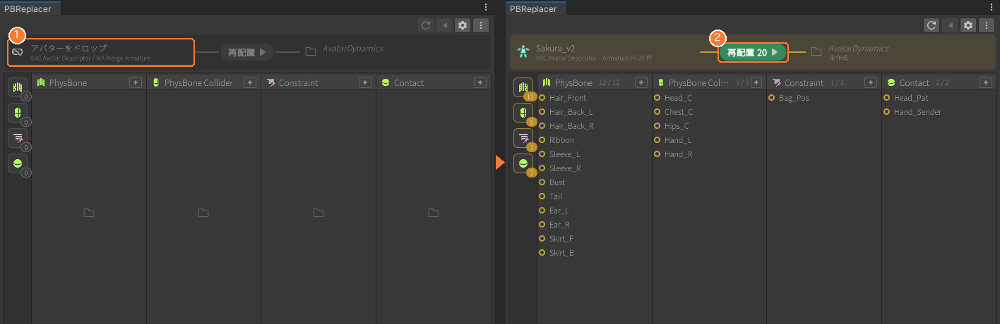
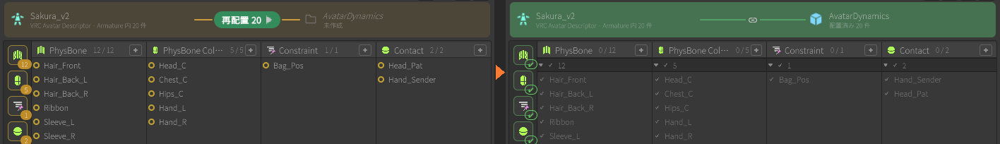
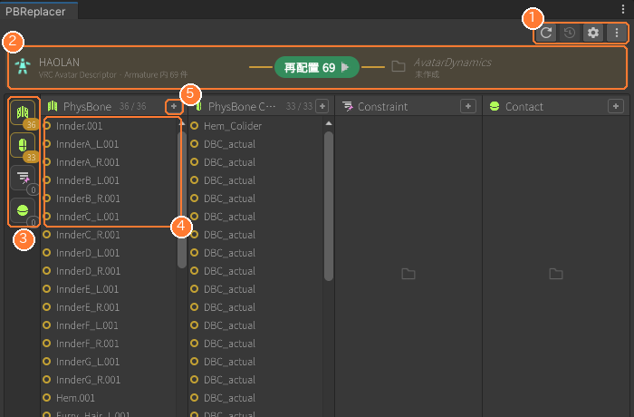
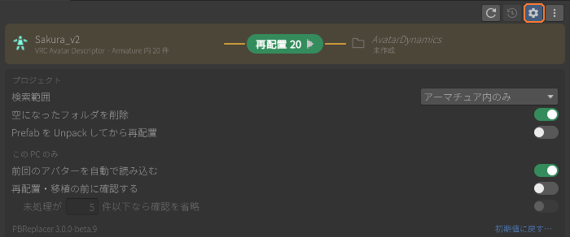
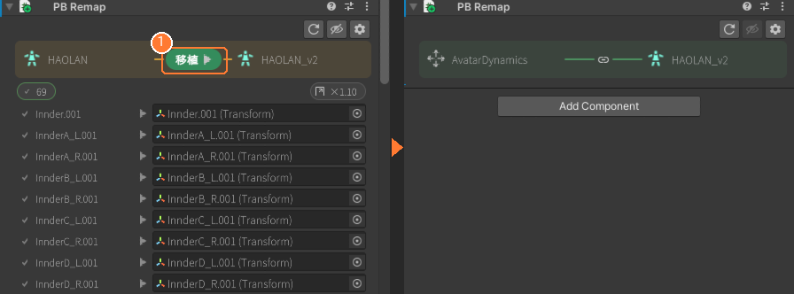
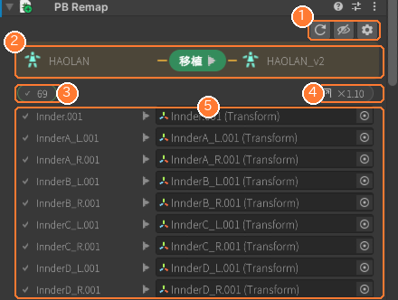
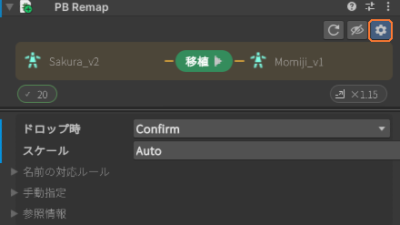

# PBReplacer

## 概要

アバターに付いているVRC関連コンポーネントを整理するUnity拡張です。

元のコンポーネントのパラメーターを保持したまま、

* PhysBone/PhysBoneCollider
* VRCContactSender/Receiver
* VRCConstraint全般

を1オブジェクト＝1コンポーネントに分けて再配置します。

## 使用用途

* **複数コンポーネントの一括編集がしたい時。**

1オブジェクト＝1コンポーネントなのでHierarchy上で複数選択すると一括編集することが出来ます。

* **アニメーションでのオンオフを簡易化させたい時。**

コンポーネントがボーンについていない為、好きな場所に移動させることができます。

服の子に付ければ服のオンオフアニメーションでPhysBoneも止めることができます。

## 使い方
　
1. **Tools > PBReplacer**（または Hierarchy の右クリック > PBReplacer for selected）でウィンドウを開く
2. 左のノードにアバターをドロップ ①（クリックして選ぶこともできます）
3. 真ん中の **再配置 n** を押す ②（n は未処理の件数）

再配置が終わるとアクションバーが緑になり、対象表示の ○ が ✔ に変わります。Ctrl+Z か ↶ で元に戻せます。

### ウィンドウの見方

| # | 部位 | 操作 |
|---|---|---|
| ① | ツールバー | ↻ 再読み込み / ↶ 元に戻す / ⚙ 詳細設定 / ⋮ その他（PBRemap を追加） |
| ② | アクションバー | 背景色が状態。オレンジ = 未処理あり　 緑 = すべて配置済み　 赤 = エラー（Console に詳細を表示） |
| ③ | カテゴリ | カテゴリのアイコン。数字が未処理の件数。クリックで列の表示切替、Alt+クリックでその列だけ表示に切替 |
| ④ | 対象表示 | ○ 未処理 / ✔ 配置済み。選択することでHierarchy上でも選択されます |
| ⑤ | ＋アイコン | Hierarchy のオブジェクトをD&Dすると、そのカテゴリのコンポーネントを追加 |

### 詳細設定（⚙）

変更はその場で保存されます。「プロジェクト」の項目はチームで共有され（ProjectSettings/）、「この PC のみ」の項目は個人設定（EditorPrefs）です。各項目の説明はマウスを乗せると表示されます。

### フォント

UI の日本語表示には [UITK Font Fix](https://github.com/c-colloid/UITKFontFix)（`jp.colloid.uitk-font-fix`）を使います。VPM の依存関係になっているので、PBReplacer を入れると一緒に導入されます。OS が日本語/中国語/韓国語のときは OS のフォント（Yu Gothic UI / Meiryo / Noto Sans CJK）、それ以外は同梱の Noto Sans JP で表示します。

## その他仕様

* RootTransformが設定されていないものは自動補完します。
* オブジェクトの名称はRootTransformのオブジェクト名になります。
* ModularAvatarを導入してる場合、MA MargeArmatuaコンポーネントの付いた衣装などにも対応しています。

### PBRemap（移植機能）

AvatarDynamics 配下の PhysBone 等を、別のアバター/衣装/小物へボーン構成の違いを吸収しながら移植します。
**AvatarDynamics を移植先へドラッグ＆ドロップするだけ**です。

1. 移植元で PBReplacer の再配置を実行し、AvatarDynamics を作る
2. メインウィンドウ右上の ⋮ →「他のアバターへ移植 (PBRemap)...」で AvatarDynamics に PB Remap を付ける（Add Component からでも同じ）。移植元のボーン参照情報は自動で保存されます
3. AvatarDynamics を移植先アバターの子へドラッグ＆ドロップし、Inspector の **移植 ▶** を押す ①（Ctrl+Z で取り消せます）

移植後はアクションバーが緑の 🔗 になり、以後そのアバターの一部として扱われます。Prefab 化して別シーン・別プロジェクトへ持ち出しても、保存済みの参照情報から解決できます。

#### Inspector の見方

| # | 部位 | 操作 |
|---|---|---|
| ① | ツールバー | ↻ 参照情報の取り直し   👁 SceneView に対応線を表示   ⚙ 詳細設定 |
| ② | アクションバー | 左が移植元、右が移植先（置き場所）。右のノードへ Hierarchy からアバター/衣装をドロップすると、その配下へ移動 |
| ③ | チップ | ✔ 解決済み / ＋ 自動作成 / ▾ 要選択 / ✖ 未解決 の件数。クリックで表の表示を切り替え |
| ④ | スケール比 | クリックで 自動 / 手動 / なし。radius や height はこの比で補正 |
| ⑤ | 対応表 | 対応付けの一覧。右の欄へボーンをドロップすると手動で対応付け、▾ の行は候補から選択 |

SceneView では青の輪（移植元）→ 緑の点（移植先）を線で結びます。赤 ✕（対応先なし）をクリックすると「ボーン対応」ツールが起動し、移植先の骨に出る点をクリックして対応を決められます。Hierarchy にも状態アイコン（🔗 接続済み / ▶ 移植できる / 参照切れ）が出ます。

#### 詳細設定（⚙）

| 項目 | 内容 |
|---|---|
| ドロップ時 | **Confirm**: 置いた後に Inspector の ▶ で移植   **AutoOnDrop**: ドロップした時点で自動で移植（候補が複数ある参照だけ保留）   **BuildOnly**: 編集時は何もせず NDMF ビルド時に非破壊で移植 |
| スケール | Auto: Hips-Head 距離比 → ボーン間距離比   Manual: 世界寸法比を手入力   None: 補正しない |
| 名前の対応ルール | ボーン名やパスが異なるアバター間で使う対応ルール（双方向に適用） |
| 手動指定 | 自動検出が正しく動かないときに移植元/移植先を指定 |

対応している移植元/移植先:

* VRCAvatarDescriptor 付きアバター（Humanoid ボーンで対応付け）
* Modular Avatar の MergeArmature 付き衣装（prefix/suffix を考慮）。衣装ルート配下に置いた AvatarDynamics は**衣装を単位**として扱われ、アバター本体のボーンや本体の AvatarDynamics には触れません
* Animator/Descriptor の無い小物（SkinnedMeshRenderer を持つオブジェクト。パス/名前で対応付け）

# 注意

* オプションでその他オブジェクトを読み込む機能もありますが、動作の保証は致しかねます。

## 連絡先

Twitter @C\_Colloid
