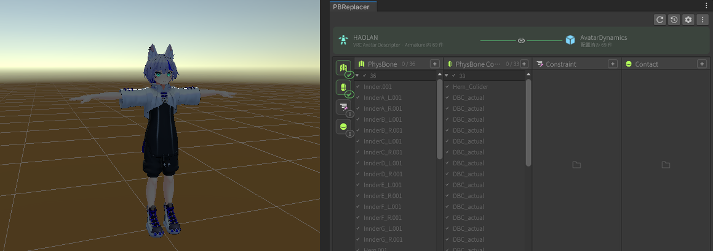

# PBReplacer

アバターに付いている VRC 関連コンポーネントを整理する Unity 拡張です。



元のコンポーネントのパラメーターを保持したまま、

* PhysBone / PhysBoneCollider
* VRCContactSender / Receiver
* VRCConstraint 全般

を 1 オブジェクト＝1 コンポーネントに分けて `AvatarDynamics` 配下へ再配置します。

## できること

* **複数コンポーネントの一括編集**　1 オブジェクト＝1 コンポーネントなので、Hierarchy で複数選択するとまとめて編集できます
* **アニメーションでのオンオフ**　コンポーネントがボーンに付いていないので、好きな場所に移動できます。服の子に置けば、服のオンオフアニメーションで PhysBone も止まります
* **別のアバターへの移植（PBRemap）**　`AvatarDynamics` を別のアバターや衣装へドラッグ＆ドロップすると、ボーン構成の違いを吸収して PhysBone 等を移植します

## 導入

VCC / ALCOM に次のリポジトリを追加し、PBReplacer をプロジェクトに追加してください。

```
https://c-colloid.github.io/PBReplacer-VPM/index.json
```

unitypackage は [Releases](https://github.com/c-colloid/PBReplacer-VPM/releases) からも入手できます。

* 依存: VRChat Avatars SDK、[UITK Font Fix](https://github.com/c-colloid/UITKFontFix)（VPM から導入すると自動で入ります）
* 対応: Modular Avatar の Merge Armature 衣装、NDMF ビルド時の非破壊移植（導入されていれば自動で有効）

## 使い方

1. **Tools > PBReplacer**（または Hierarchy の右クリック > PBReplacer for selected）でウィンドウを開く
2. 左のノードにアバターをドロップ ①
3. 真ん中の **再配置 n** を押す ②


再配置が終わるとアクションバーが緑になります。Ctrl+Z か ↶ で元に戻せます。

## PBRemap（移植）

再配置で作った `AvatarDynamics` に PB Remap を付け、移植先のアバターへドラッグ＆ドロップして Inspector の **移植 ▶** を押します。


## ドキュメント

* [使い方](Docs~/Usage.md) ─ ウィンドウの見方、詳細設定、対応しているアバター
* [PBRemap](Docs~/PBRemap.md) ─ 手順、Inspector の見方、対応先がないボーンの直し方、詳細設定
* [困ったとき](Docs~/Troubleshooting.md)

## クレジット

スクリーンショットには「[-ハオラン-HAOLAN【オリジナル3Dモデル】](https://booth.pm/ja/items/3818504)」（かなﾘぁさんち）を使用しています。

## 連絡先

Twitter @C\_Colloid
